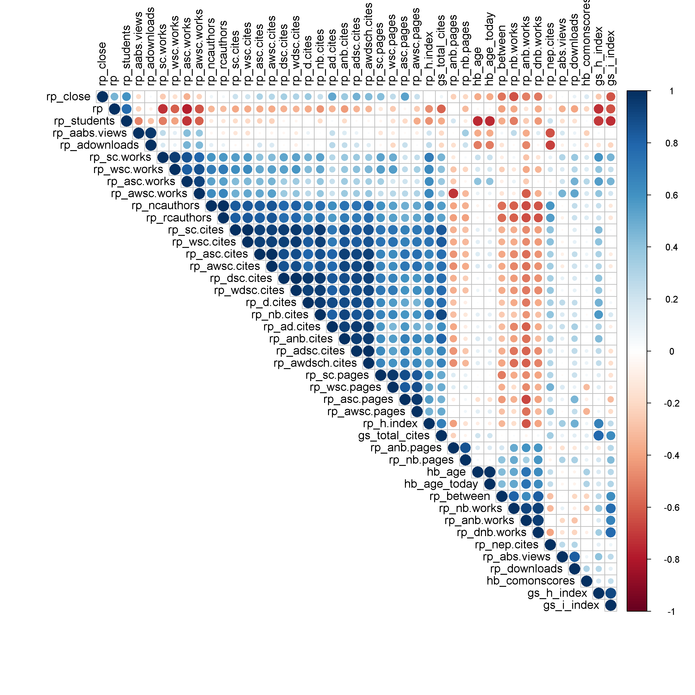

[](http://quantlet.de/index.php?p=info)

## [](http://quantlet.de/) **ARRcormer** [](http://quantlet.de/d3/ia)


##  **ARRcormer**

```yaml

Name of QuantLet : ARRcormer

Published in : ARR - Academic Rankings Research

Description : 'Plots linear correlation between 43 score values of Handelsblatt 
(HB), RePEc (RP) and Google Scholar (GS) rankings in an upper triangular matrix. 
The values are clustered.'

Keywords : 'plot, correlation, correlation matrix, dependence, multivariate, 
multivariate analysis, visualization, data visualization, analysis, discriptive methods'

See also : ARRmosage, ARRmosagegr, ARRhexage

Author : Alona Zharova

Submitted : Tue, November 24 2015 by Alona Zharova, Marius Sterling

Datafile : 'ARRdata.csv - The data set contains different researcher (3011 rows) 
of either RePEc (77 columns), Handelsblatt (42 columns) ranking or both and 
their Google Scholar data (16 columns) as well as age and subject fields (2 colums)'

Example : Correlation matrix

```




```r

# clear history
rm(list = ls(all = TRUE))
graphics.off()

# Settings
font = "sans"  # Helvetica
res  = 300  # setting resolution of plot

# activating required packages, if they are not installed they first get installed
libraries = c("corrplot")
lapply(libraries, function(x) if (!(x %in% installed.packages())) {
  install.packages(x)
})
lapply(libraries, library, quietly = TRUE, character.only = TRUE)

# data input and selection of all score values (no rankings)
data = read.csv2("ARRdata.csv", sep = ";", dec = ",", 
  header = T, stringsAsFactors = FALSE)
data = data[!is.na(data$hb_comonscores) & !is.na(data$rp_author) & !is.na(data$gs_author), ]
data2 = data[, grepl(pattern = "hb_age|hb_comonscores", x = colnames(data)) | (grepl(pattern = "rp_", 
  x = colnames(data)) & grepl(pattern = "score", x = colnames(data))) | (grepl(pattern = "gs_total_cites|gs_h_index|gs_i_index", 
  x = colnames(data)))]

# correcting data (if it is not numeric) and deleting the endings score
x = apply(X = data2, MARGIN = 2, FUN = as.numeric)
colnames(x) = gsub(pattern = "_score", replacement = "", x = colnames(x))

# computing the correlation matrix
mcor = cor(x, method = c("pearson"), use = "pairwise.complete.obs")  # 'pearson', 'kendall', 'spearman'

# plot of the correlation matrix
png(file = "ARRcormer.png", width = 10, height = 10, unit = "in", res = res, family = font)
corrplot(mcor, type = "upper", order = "hclust", tl.col = "black")
# type=upper: upper triangular matrix!  order: 'orignial'= as is in the matrix,
# 'hclust' hierarchical clustering, 'alphabet'= in alphabetical order!  tl.col:
# color of the text labels!
dev.off()

```
