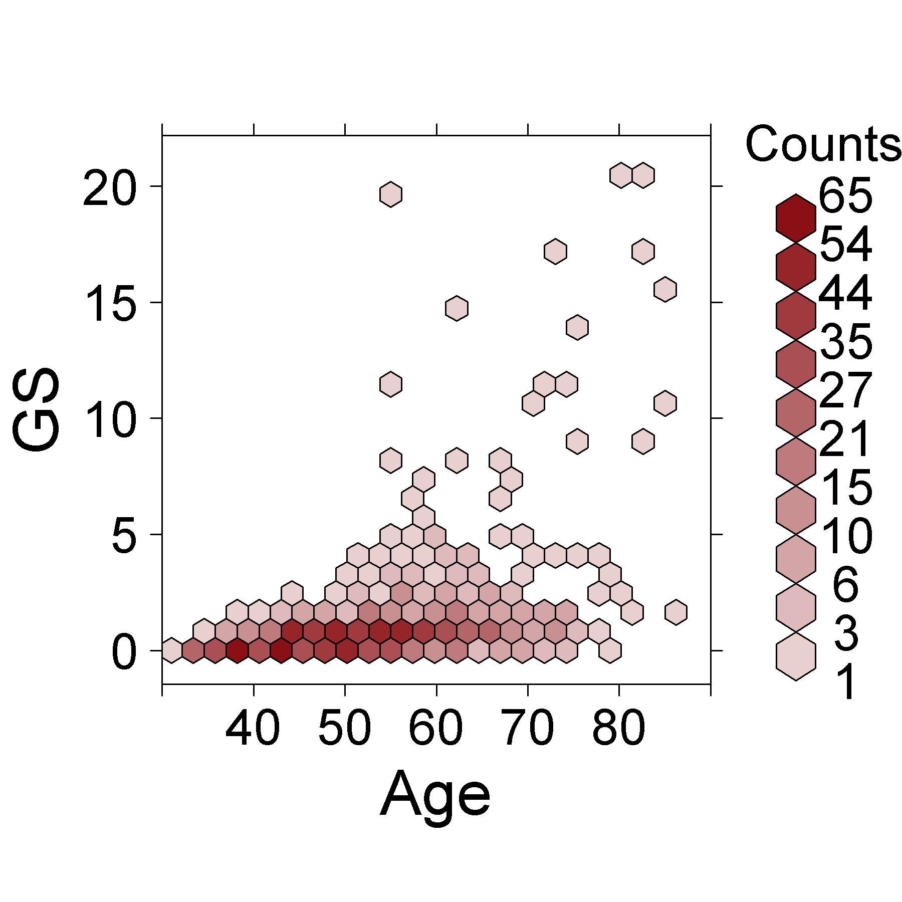
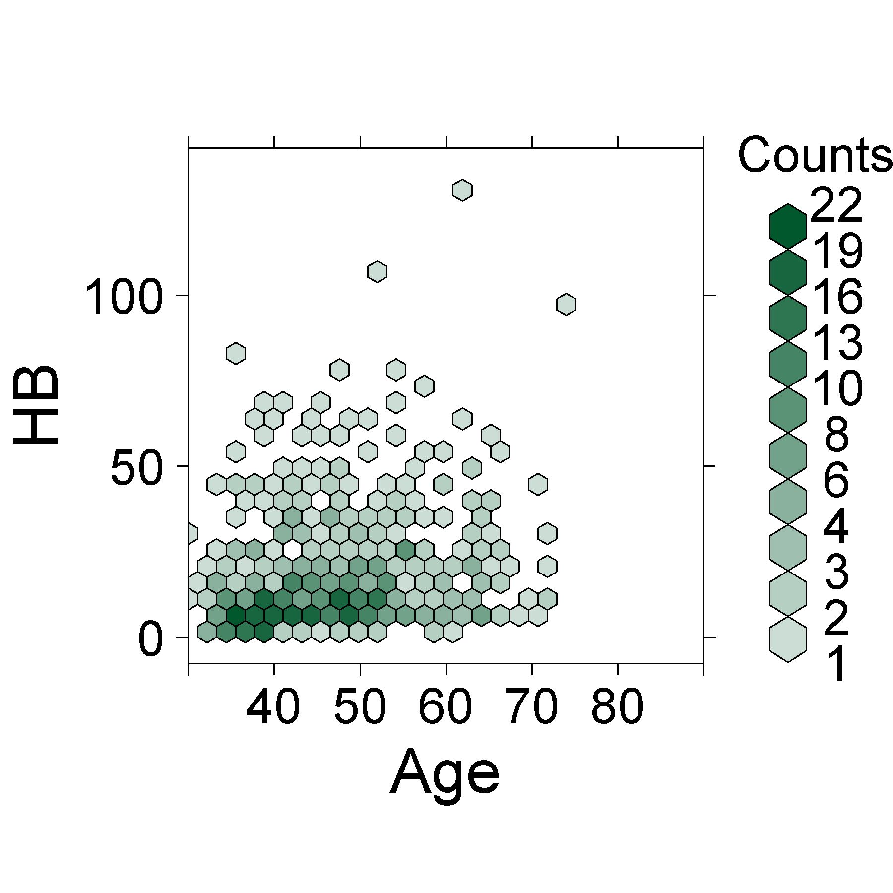
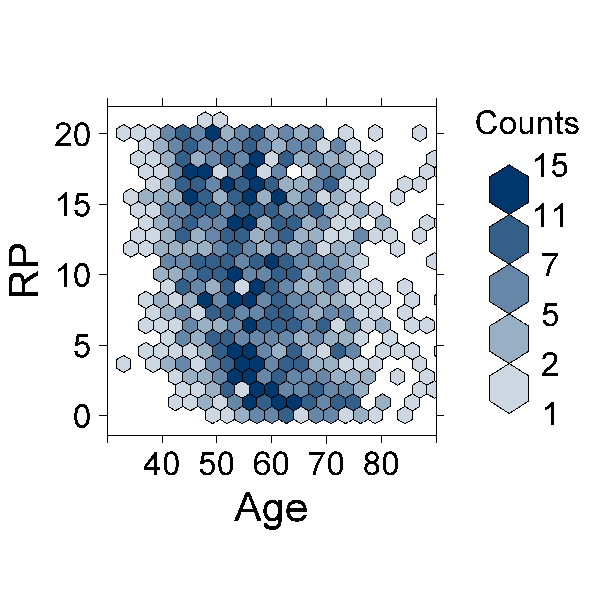

[](http://quantlet.de/index.php?p=info)

## [](http://quantlet.de/) **ARRhexage** [](http://quantlet.de/d3/ia)


```yaml

Name of QuantLet : ARRhexage

Published in : ARR - Academic Rankings Research

Description : 'Produces hexagon plots between age and top ranking scores of 
Handelsblatt (HB), RePEc (RP) and Google Scholar (GS) rankings'

Keywords : 'plot, hexagon-plot, scatterplot, analysis, multivariate analysis, 
multivariate, visualization, data visualization, counts, dependence, discriptive methods'

See also : ARRmosage, ARRmosagegr, ARRcormer

Author : Alona Zharova

Submitted : Tue, November 24 2015 by Alona Zharova, Marius Sterling

Datafile : 'ARRdata.csv - The data set contains different researcher (3011 rows) 
of either RePEc (77 columns), Handelsblatt (42 columns) ranking or both and 
their Google Scholar data (16 columns) as well as age and subject fields (2 colums)'

Example : Hexagon plot

```








```r

# Close windows and clear variables
graphics.off()
rm(list = ls(all = TRUE))

# Install Packages
libraries = c("hexbin")
lapply(libraries, function(x) if (!(x %in% installed.packages())) {
  install.packages(x)
})
lapply(libraries, library, quietly = TRUE, character.only = TRUE)

# setting (font, size etc.) for output
font                 = "sans" # Font Helvetica
label.size.main_axis = 2.5    # size of label symbols
label.size.support   = 2      # size of axes label symbols
col.from             = 0.2    # shading from this percentage on (number between 0 and 1)
res                  = 300    # resolution of pictures in ppi
hbxbins              = 20

# data input and selection of overall scores of HB, RePEc and GS and age
data     = read.csv2("ARRdata.csv",sep=";",dec=",",header = T,stringsAsFactors = FALSE)
data1    = data[!is.na(data$age_combined),]
subagehb = na.exclude(data1[order(data1$hb_comonscores,decreasing = T),grep(pattern = "age_combined|hb_comonscores",colnames(data1))])
subagerp = na.exclude(data1[order(as.numeric(data1$rp_score),decreasing = F),grep(pattern = "age_combined|rp_score",colnames(data1))])
subagegs = na.exclude(data1[order(data1$gs_total_cites,decreasing = T),grep(pattern = "age_combined|gs_total_cites",colnames(data1))])

# selecting data
ageshb = subagehb[, "age_combined"] 
agesrp = subagerp[, "age_combined"]
agesgs = subagegs[, "age_combined"]
hb     = subagehb[, "hb_comonscores"]
rp     = subagerp[, "rp_score"]
gs     = subagegs[, "gs_total_cites"] 

# setting colors 
max      = 255
az_red   = rgb(138, 15, 20,alpha=0.999999 *max,maxColorValue = max)
az_green = rgb(  0, 87, 44,alpha=0.999999 *max,maxColorValue = max)
az_blue  = rgb(  0, 55,108,alpha=0.999999 *max,maxColorValue = max)


png(file="ARRhexagehb.png",width=6, height=6,units="in",res=res,family = font)
  hexbinplot(hb ~ ageshb,
             xbins      = hbxbins,
             xlab       = list(label="Age",cex=label.size.main_axis),
             xlim       = c(30,90),
             ylab       = list(label="HB", cex=label.size.main_axis),
             style      = "colorscale",
             border     = TRUE, 
             aspect     = 1,
             trans      = sqrt, 
             inv        = function(ages) ages ^ 2, 
             scales     = list(cex=label.size.support),
             cex.labels = label.size.support, 
             cex.title  = label.size.support, 
             colramp    = function(n){rgb(  0, 87, 44,alpha=seq(from = col.from,to=0.999999,length=n)*max,maxColorValue = max)},
             colorcut=c(0,.1,.2,.3,.4,.5,.6,.7,.8,.9,1) 
             )
  #style: string specifying the style of hexagon plot, see 'grid.hexagons' for the possibilities! 
  #border=TRUE: frame around the hexagons! 
  #trans: specifying a transformation for the counts! 
  #inv: the inverse transformation of trans! 
  #scales: the inverse transformation of trans! 
  #coloramp: color of hexagon depends on count it represents as greater counts as darker! 
  #colorcut: setting number of different colored hexagons by setting intervals! 
dev.off()

png(file="ARRhexagerp.png",width=6, height=6,units="in",res=res,family = font)
  hexbinplot(rp/100~ agesrp,
             xlab = list(label="Age",cex=label.size.main_axis),
             xlim=c(30,90),
             ylab = list(label="RP", cex=label.size.main_axis,ylim =c(8,0)),
             style = "colorscale",
             border = TRUE,
             aspect = 1,
             trans =sqrt,
             inv = function(ages) ages ^ 2,
             cex.labels=label.size.support,
             cex.title=label.size.support,
             scales=list(cex=label.size.support),
             colramp= function(n){rgb(  0, 55,108,alpha=seq(from = col.from,to=1,length=n)*max,maxColorValue = max)},
             colorcut=c(0,.2,.4,.6,.8,1)
             )
dev.off()

png(file="ARRhexagegs.png",width=6, height=6,units="in",res=300,family = font)
  hexbinplot(gs/10000~ agesgs,
             xlab = list(label="Age",cex=label.size.main_axis),
             xlim=c(30,90),
             ylab = list(label="GS", cex=label.size.main_axis),
             style = "colorscale",
             border = TRUE,
             aspect = 1,
             trans = sqrt,
             inv = function(ages) ages ^ 2,
             cex.labels=label.size.support,
             cex.title=label.size.support,
             scales=list(cex=label.size.support),
             colramp= function(n){rgb(138, 15, 20,alpha=seq(from = col.from,to=0.999999,length=n)*max,maxColorValue = max)},
             colorcut=c(0,.1,.2,.3,.4,.5,.6,.7,.8,.9,1)
             )
dev.off()

```
