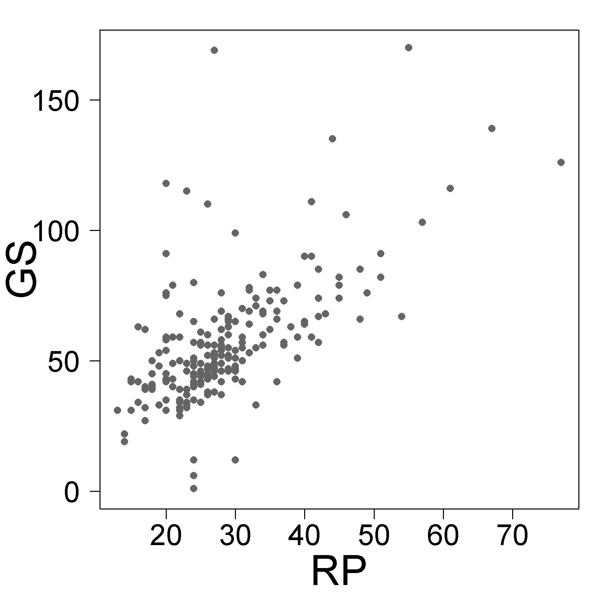
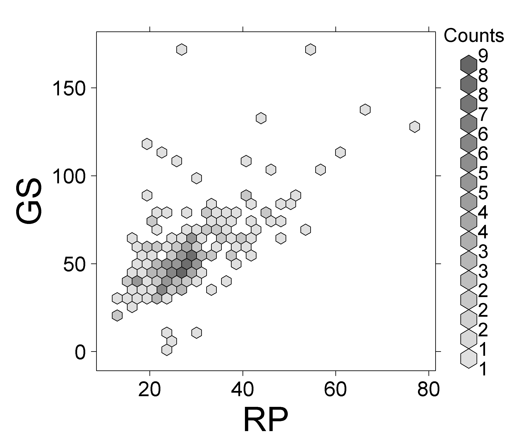

##  **ARRhexcit**

```yaml

Name of QuantLet : ARRhexhin

Published in : ARR - Academic Rankings Research

Description : 'Produces scatter and hexagon plots between the h-index score 
listed in RePEc (RP) and Google Scholar (GS) rankings'

Keywords : 'plot, hexagon-plot, scatterplot, analysis, multivariate analysis, 
multivariate, visualization, data visualization, counts, dependence, discriptive methods'

See also : ARRmosage, ARRmosagegr, ARRcormer, ARRhexage, ARRhexhin

Author : Alona Zharova

Submitted : Tue, November 24 2015 by Alona Zharova, Marius Sterling

Datafile : 'ARRdata.csv - The data set contains different researcher (3011 rows) 
of either RePEc (77 columns), Handelsblatt (42 columns) ranking or both and 
their Google Scholar data (16 columns) as well as age and subject fields (2 colums)'

Example : Scatter plot, Hexagon plot

```





```r

# clear history
graphics.off()
rm(list = ls(all = TRUE))

#loading library
libraries = c("hexbin")
lapply(libraries,function(x)if(!(x %in% installed.packages())){install.packages(x)})
lapply(libraries,library,quietly=TRUE,character.only=TRUE)

# setting (font, color) for output
color                = 100        # color of plot symbols and hexagons, value between 1 (black) and 254 (white)
font                 = "sans"     # Helvetica
res                  = 300

# scatterplot
cex                  = 1          # size of plot symbol
pch                  = 16         # plot symbol, 16= filled circle
cex_lab              = 2.5        # size of label symbols
cex_axis             = 1.75       # size of axes label symbols
cex_main             = 2.5        # size of main label symbols

# hexbinplot
label.size.main_axis = 3.1        # size of label symbols
label.size.support   = 1.75       # size of axes label symbols
col.from             = 0.2        # shading from this percentage on (number between 0 and 1)

# data input and selection of h-index of RePEc and GS
data  = read.csv2("ARRdata.csv",sep=";",dec=",",header = T,stringsAsFactors = FALSE)
data  = data[!is.na(data$rp_author)&!is.na(data$gs_author),]
data2 = data[!is.na(data$rp_h.index_score),]

# scatterplot GS and RP h.index
png(file="ARRhexhinscat.png",width=6, height=6,units="in",res=res,family = font)
  par(cex.lab=cex_lab,cex.axis=cex_axis,cex.main=cex_main,las=1,pty="s",mar=c(4,5,1,1))# las=1: horizontal axes tick labels, pty=s: squared plotting region
  plot(data$rp_h.index_score,data$gs_h_index,xlab = "RP", ylab = "GS",pch=pch,col=rgb(  color, color, color,alpha = 254,maxColorValue = 255),cex =cex)
dev.off()

png(file="ARRhexhinbin.png",width=7.75, height=6.75,units="in",res=res,family = font)
  hexbinplot(data2$gs_h_index ~ data2$rp_h.index_score,
             xlab       = list(label="RP",cex=label.size.main_axis),
             ylab       = list(label="GS", cex=label.size.main_axis),
             style      = "colorscale", 
             border     = TRUE, 
             aspect     = 1, 
             trans      = sqrt, 
             inv        = function(ages) ages ^ 2,
             scales     = list(cex=label.size.support+0.15),
             cex.labels = label.size.support,
             cex.title  = label.size.support,
             colramp    = function(n){rgb(  1, 1, 1,alpha=seq(from = col.from,to=0.999,length=n)*(255-color),maxColorValue = 255)}
  )
  # style=colorscale: string specifying the style of hexagon plot, see 'grid.hexagons' for the possibilities! 
  # border=TRUE: frame around the hexagons! 
  # coloramp: color of hexagon depends on count it represents as greater counts as darker! 
dev.off()

cor(data2$rp_h.index_score,data2$gs_h_index)

```
