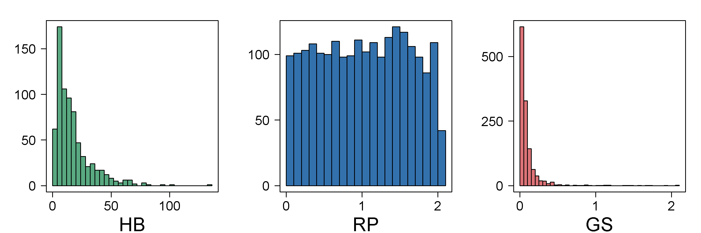

[](http://quantlet.de/index.php?p=info)

## [](http://quantlet.de/) **ARRhismer** [](http://quantlet.de/d3/ia)


```yaml

Name of QuantLet : ARRhismer

Published in : ARR - Academic Rankings Research

Description : 'Plots an image of 3 histograms one each of Handelsblatt (HB) common score, 
RePEc (RP) total score and Google Scholar (GS) citations'

Keywords : 'plot, hexagon-plot, scatterplot, analysis, multivariate analysis, 
multivariate, visualization, data visualization, counts, dependence, discriptive methods,
histogram, distribution, density, graphical representation, estimation, smoothing, 
descriptive, descriptive methods'

See also : ARRmosage, ARRmosagegr, ARRcormer, ARRhexage, ARRhexcit, ARRhexhin

Author : Alona Zharova

Submitted : Tue, November 24 2015 by Alona Zharova, Marius Sterling

Datafile : 'ARRdata.csv - The data set contains different researcher (3011 rows) 
of either RePEc (77 columns), Handelsblatt (42 columns) ranking or both and 
their Google Scholar data (16 columns) as well as age and subject fields (2 colums)'

Example : Histogram

```




```r


# close windows and clear variables
graphics.off()
rm(list=ls(all=TRUE))

# picture settings
font     = "sans" # Helvetica
cex.lab  = 2.25   # x and y label size
cex.axis = 1.5    # axes annotation size

# color settings
max      = 180
az_red   = rgb(138, 15, 20,alpha=0.6  *max,maxColorValue = max)
az_green = rgb(  0, 87, 44,alpha=0.65 *max,maxColorValue = max)
az_blue  = rgb(  0, 55,108,alpha=0.8  *max,maxColorValue = max)

# input data
data = read.csv2("ARRdata.csv",sep=";",dec=",",header = T,stringsAsFactors = FALSE)
x    = unlist(data$hb_comonscores[!is.na(data$hb_comonscores)])

# function for the breaks used in the histogram plot
breaks = function(x,x0,h){
  b = floor((min(x)-x0)/h) : ceiling((max(x)-x0)/h)
  b = b*h+x0
  return(b)
}
 
# plot histograms
png(file="ARRhismer.png",width=9, height=3,units="in",res=300,family = font)
 
# plot settings with pty=s: square plotting region! las=1: style of axis labels, here always horizontal!  
  par(pty      = "s", 
      mfrow    = c(1,3),
      mar      = c(4,4,2,1),
      cex.lab  = cex.lab, 
      cex.axis = cex.axis,
      las      = 1, 
      mgp      = c(3,1,0),
      oma      = c(0,0,0,0)
  )  
 
  # HB histogram
  hist(x,freq = T,main=NA,breaks=breaks(x,x0=0,4),xlab="HB",ylab=NA,axes=F,col=az_green)
  # axis ticks labels
  ax=c(0:5)/2*100
  axis(1,at=ax,labels=ax,cex.axis=cex.axis)
  ax=c(0:8)/3*150
  axis(2,at=ax,labels=ax,cex.axis=cex.axis)
  box(lwd=1)
 
  # RP histogram
  rp_score = as.numeric(data$rp_score[!is.na(data$rp_author)])
  hist(rp_score/10^3,freq = T,breaks=breaks(rp_score/10^3,x0=0,0.1),main=NA,xlab="RP",ylab=NA,axes=F,col=az_blue)
  # axis ticks labels
  ax=c(0:2)
  axis(1,at=ax,labels=ax,cex.axis=cex.axis)
  ax=c(0:2)*50
  axis(2,at=ax,labels=ax,cex.axis=cex.axis)
  box(lwd=1)
 
  # GS histogram
  gs_cit=data$gs_total_cites[!is.na(data$gs_total_cites)]
  hist(gs_cit/10^5,freq = T,main=NA,xlab="GS",ylab=NA,breaks=breaks(gs_cit/10^5,x0=0,0.05),axes=F,col=az_red)
  # axis ticks labels
  ax=c(0:2)
  axis(1,at=ax,labels=ax,cex.axis=cex.axis)
  ax=c(0:2)*250
  axis(2,at=ax,labels=ax,cex.axis=cex.axis)
  box(lwd=1)
 
dev.off()

```
