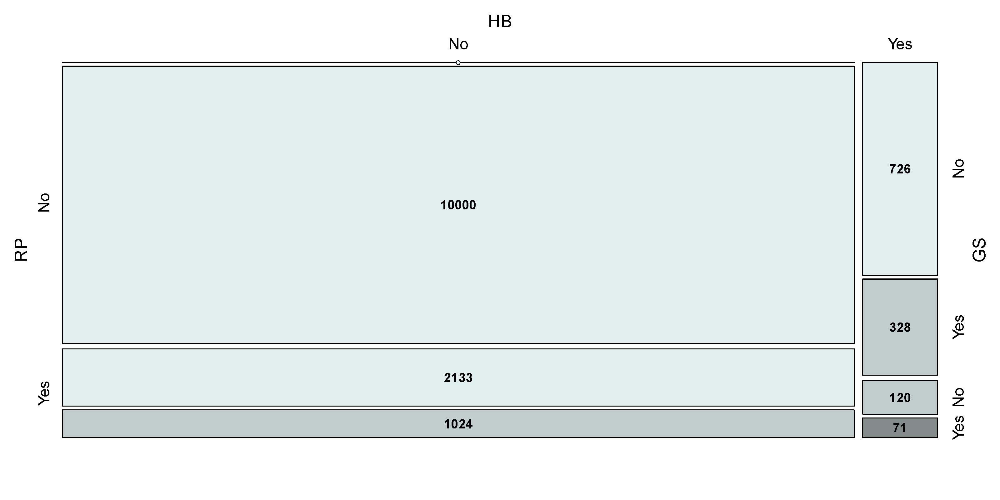

[](http://quantlet.de/index.php?p=info)

## [](http://quantlet.de/) **ARRmosage** [](http://quantlet.de/d3/ia)


```yaml

Name of QuantLet : ARRmosage

Published in: ARR - Academic Rankings Research

Description : 'Produces the mosaic plot of number of 
researchers, when merging of Handelsblatt (HB), 
RePEc (RP) and Google Scholar (GS) rankings takes place'   

Keywords : 'mosaic plot, multivariate, data visualization, analysis, discriptive methods'

See also : ARRmosagegr, ARRcormer, ARRhexage

Author : Alona Zharova

Datafile : 'ARRmosage.csv - The data set contains the number of researchers who  
are in one, two or all three rankings (HB, RP, GS)'

Example : Mosaic plot
```




```r

# clear variables
rm(list=ls(all=TRUE))

# Install Packages
libraries = c("vcd")
lapply(libraries, function(x) if (!(x %in% installed.packages())) {
  install.packages(x)
})
lapply(libraries, library, quietly = TRUE, character.only = TRUE)

# setting (font, color) for output, depending on choice
font         = "Helvetica"
azure.colors = c("azure1","azure2","azure3","azure4")

# load data
m            = read.csv2("ARRmosage.csv", header = TRUE)
m            = m[order(m[,2],m[,3],m[,4],decreasing = F),]
colgr        = 1+(m$HB=="Yes")+(m$RP=="Yes")+(m$GS=="Yes")
m$color      = azure.colors[colgr]

# If you want to use this plot in a latex document than remove the hash-symbols infront of pdf(...) and dev.off()!
# pdf(...) creates a pdf file named "ARRmosage.pdf" of graphics between pdf(...) and dev.off() 
# pdf(file="ARRmosage.pdf",width=16, height=8,fonts = font)

# mosaic plot of age groups against Ranking groups
  mosaic(~HB + RP + GS, data=m, 
         gp                = gpar(fill = m$color),                                                  # coloring according to number of merged rankings
         shade             = TRUE,                                                                  # coloring according to gp
         direction         = c("v", "h", "h"),                                                      # setting the axis 
         labeling          = labeling_values,                                                       # writing the values in the boxes
         gp_text           = gpar(fontsize = 15,fontface = 2),                                          # setting of the cell labels
         labeling_args     = list(gp_labels = gpar(fontsize = 18, fontface = 1),
                                  gp_varnames = gpar(fontsize = 20, fontface = 1)),                  # settings for the axis labels (font, fontsize)
         keep_aspect_ratio = FALSE,                                                                 # allowing different length and width of plot, here fitted to pdf size
         margins           = unit(5, "lines")                                                       # spacing from margins
         )
# dev.off() 

```
