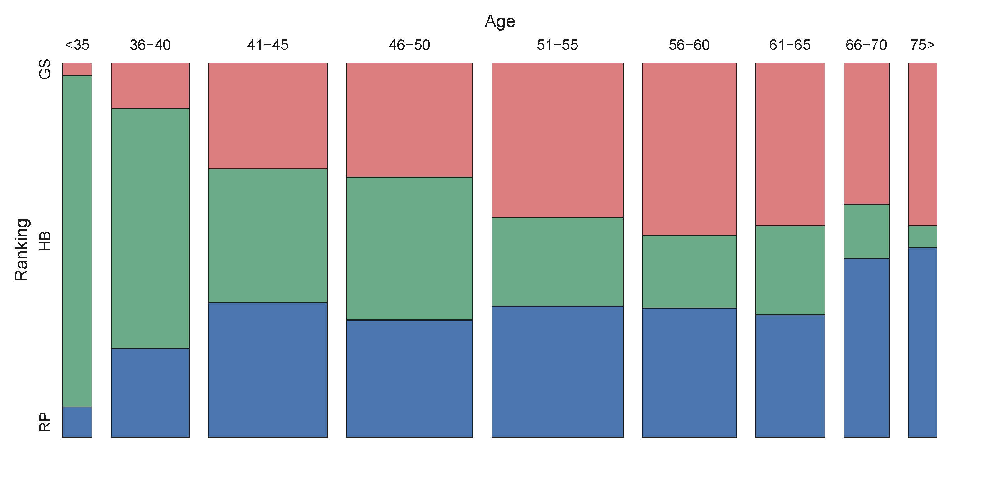

[](http://quantlet.de/index.php?p=info)

## [](http://quantlet.de/) **ARRmosagegr** [](http://quantlet.de/d3/ia)


```yaml

Name of QuantLet : ARRmosagegr

Published in: 'ARR - Academic Rankings Research'

Description : 'Produces the mosaic plot of Top-700 scientists of Handelsblatt (HB), RePEc (RP) 
and Google Scholar (GS) each one'

Keywords : 'mosaic plot, plot, multivariate, data visualization, visualization, analysis, 
descriptive methods, graphical representation, descriptive statistics, descriptive, multivariate analysis '

See also : ARRmosage, ARRhexage, ARRcormer

Author : Alona Zharova

Datafile : 'ARRmosagegr.csv - The data set contains the number of researchers of certain age classes who 
are in HB, RP or GS'

Example: Mosaic plot
```




```r
# clear variables
rm(list=ls(all=TRUE))

# Install Packages
libraries = c("vcd")
lapply(libraries, function(x) if (!(x %in% installed.packages())) {
  install.packages(x)
})
lapply(libraries, library, quietly = TRUE, character.only = TRUE)

# define colors
max         = 180
az_red      = rgb(138, 15, 20,alpha=0.6 *max,maxColorValue = max)
az_green    = rgb(  0, 87, 44,alpha=0.65*max,maxColorValue = max)
az_blue     = rgb(  0, 55,108,alpha=0.8 *max,maxColorValue = max)

# setting (color) for output, depending on choice
fill_color  = c(az_red,az_green,az_blue)

# load data file
n           = read.csv2("ARRmosagegr.csv", header = TRUE)

# If you want to use this plot in a latex document than remove the hash-symbols infront of pdf(...) and dev.off()!
# pdf(...) creates a pdf file named "ARRmosagegr.pdf" of graphics between pdf(...) and dev.off() 
# pdf(file="ARRmosagegr.pdf",width=16, height=8)

# mosaic plot of age groups against Ranking groups
  mosaic(~Age + Ranking, data=n, 
         gp                = gpar(fill =matrix(rep(fill_color,times =9),ncol=3,byrow = T),col = 9), # coloring so that all HB, GS and RP are colored the same
         shade             = TRUE,                                                                  # coloring according to gp
         direction         = c("v", "h"),                                                           # setting the axis 
         spacing           = spacing_highlighting(start = unit(1, "lines")),                        # spacing between age groups
         labeling_args     = list(gp_labels = gpar(fontsize = 17, fontface = 1),
                              gp_varnames = gpar(fontsize =20, fontface = 1)),						# settings for the axis labels (font, fontsize)
         keep_aspect_ratio = FALSE,                                                                 # allowing different length and width of plot, here fitted to pdf size
         margins           = unit(5, "lines")                                                       # spacing from margins
         )
#dev.off()

```
