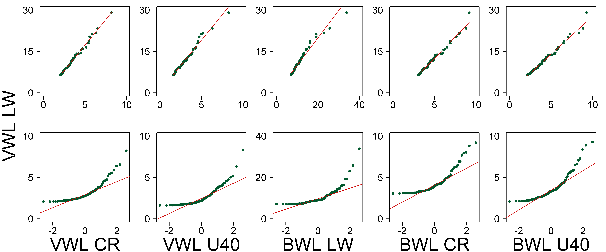

##  **ARRreghb**

```yaml

Name of QuantLet : ARRreghb

Published in : ARR - Academic Rankings Research

Description : 'Computes a linear regression of Handelsblatt (HB) VWL Life Work ranking (Lw)
 - X1 on VWL Current REsearchers (CR) - X2, VWL Under 40 (U40) - X3, BWL LW (X4), 
BWL CR (X5) and BWL U40 (X6) from the HB data set.
Plots the scatter plot with linear regression and qq-plot of HB VWL Lw (X1) on VWL CR (X2), 
VWL U40 (X3), BWL LW (X4), BWL CR (X5) and BWL U40 (X6).'

Keywords : 'plot, scatterplot, analysis, multivariate analysis, 
multivariate, visualization, data visualization, dependence, discriptive methods,
distribution, graphical representation, descriptive, descriptive methods, regression,
linear, linear-regression, qq-plot, normal'

See also : ARRmosage, ARRmosagegr, ARRcormer, ARRhexage, ARRhexcit, ARRhexhin, ARRhismer

Author : Alona Zharova

Submitted : Tue, November 24 2015 by Alona Zharova, Marius Sterling

Datafile : 'ARRdata.csv - The data set contains different researcher (3011 rows) 
of either RePEc (77 columns), Handelsblatt (42 columns) ranking or both and 
their Google Scholar data (16 columns) as well as age and subject fields (2 columns)'

Example : Linear regression, Scatter plot, QQ-plot

```




```r


# clear variables and close windows
rm(list=ls(all=TRUE))
graphics.off()

# setting (font, color) for png output
az_green    = rgb(  0, 87, 44,alpha=0.999999 *255,maxColorValue = 255)
font        = "sans" # it is Helvetica
lwd_regline = 1      # line width of regression line
cex         = 1      # size of graphic symbols of xy-plot
cex.lab     = 3.25   # size of axis labels
cex.axis    = 1.75   # size of tick labels
pch         = 16     # graphic symbol of xy-plot: 1 - circle not filled, 16 - circle filled
res         = 600    # resolution of png in ppi

# load data
data= read.csv2("ARRdata.csv",sep=";",dec=",",header = T,stringsAsFactors = FALSE)

# define variables of the model and picking them from the data matrix
y  = data[,grep(pattern = "vwl2013_lw_score", x = colnames(data))] # X1 (VWL LW)
X2 = data[,grep(pattern = "vwl2013_cr_score", x = colnames(data))] # X2 (VWL CR)
X3 = data[,grep(pattern = "vwl2013_u40_score",x = colnames(data))] # X3 (VWL U40)
X4 = data[,grep(pattern = "bwl2014_lw_score", x = colnames(data))] # X4 (BWL LW)
X5 = data[,grep(pattern = "bwl2014_cr_score", x = colnames(data))] # X5 (BWL CR)
X6 = data[,grep(pattern = "bwl2014_u40_score",x = colnames(data))] # X6 (BWL U40)

last = 100

# picking only the top [last] values of the rankings
y  = sort(y [!is.na(y)] ,decreasing = T)[1:last]
X2 = sort(X2[!is.na(X2)],decreasing = T)[1:last]
X3 = sort(X3[!is.na(X3)],decreasing = T)[1:last]
X4 = sort(X4[!is.na(X4)],decreasing = T)[1:last]
X5 = sort(X5[!is.na(X5)],decreasing = T)[1:last]
X6 = sort(X6[!is.na(X6)],decreasing = T)[1:last]

yX2 = cbind(rep(1,length(X2)),X2)
yX3 = cbind(rep(1,length(X3)),X3)
yX4 = cbind(rep(1,length(X4)),X4)
yX5 = cbind(rep(1,length(X5)),X5)
yX6 = cbind(rep(1,length(X6)),X6)

# fit the model y~X
yx2 = solve(t(yX2)%*%yX2)%*%t(yX2)%*%y	# regression of (X1) VWL LW on (X2) VWL CR
yx3 = solve(t(yX3)%*%yX3)%*%t(yX3)%*%y  # regression of (X1) VWL LW on (X3) VWL U40
yx4 = solve(t(yX4)%*%yX4)%*%t(yX4)%*%y  # regression of (X1) VWL LW on (X4) BWL LW
yx5 = solve(t(yX5)%*%yX5)%*%t(yX5)%*%y  # regression of (X1) VWL LW on (X5) BWL CR
yx6 = solve(t(yX6)%*%yX6)%*%t(yX6)%*%y  # regression of (X1) VWL LW on (X6) BWL U40

# degrees of freedom
mn2 = dim(yX2);
df2 = mn2[1]-mn2[2];
mn3 = dim(yX3);
df3 = mn3[1]-mn3[2];
mn4 = dim(yX4);
df4 = mn4[1]-mn4[2];
mn5 = dim(yX5);
df5 = mn5[1]-mn5[2];
mn6 = dim(yX6);
df6 = mn6[1]-mn6[2];

# fitted values
yhat2 = yX2%*%yx2;
yhat3 = yX3%*%yx3;
yhat4 = yX4%*%yx4;
yhat5 = yX5%*%yx5;
yhat6 = yX6%*%yx6;

# residuals
r2 = y - yhat2;
r3 = y - yhat3;
r4 = y - yhat4;
r5 = y - yhat5;
r6 = y - yhat6;

# mean square error
mse2 = t(r2)%*%r2/df2;
mse3 = t(r3)%*%r3/df3;
mse4 = t(r4)%*%r4/df4;
mse5 = t(r5)%*%r5/df5;
mse6 = t(r6)%*%r6/df6;

# covariance matrix
covar2 = solve(t(yX2)%*%yX2)%*%diag(rep(mse2,2));
covar3 = solve(t(yX3)%*%yX3)%*%diag(rep(mse3,2));
covar4 = solve(t(yX4)%*%yX4)%*%diag(rep(mse4,2));
covar5 = solve(t(yX5)%*%yX5)%*%diag(rep(mse5,2));
covar6 = solve(t(yX6)%*%yX6)%*%diag(rep(mse6,2));

# standard deviation
se2 = sqrt(diag(covar2));
se3 = sqrt(diag(covar3));
se4 = sqrt(diag(covar4));
se5 = sqrt(diag(covar5));
se6 = sqrt(diag(covar6));

# t-test
t2  = yx2/se2;
t22 = abs(t2);
k2  = t22^2/(df2 + t22^2);
p2  = 0.5*(1+sign(t22)*pbeta(k2, 0.5, 0.5*df2)) ;
Pvalues2 = 2*(1-p2);

t3  = yx3/se3;
t32 = abs(t3);
k3  = t32^2/(df3 + t32^2);
p3  = 0.5*(1+sign(t32)*pbeta(k3, 0.5, 0.5*df3)) ;
Pvalues3 = 2*(1-p3);

t4  = yx4/se4;
t42 = abs(t4);
k4  = t42^2/(df4 + t42^2);
p4  = 0.5*(1+sign(t42)*pbeta(k4, 0.5, 0.5*df4)) ;
Pvalues4 = 2*(1-p4);

t5  = yx5/se5;
t52 = abs(t5);
k5  = t52^2/(df5 + t52^2);
p5  = 0.5*(1+sign(t52)*pbeta(k5, 0.5, 0.5*df5)) ;
Pvalues5 = 2*(1-p5);

t6  = yx6/se6;
t62 = abs(t6);
k6  = t62^2/(df6 + t62^2);
p6  = 0.5*(1+sign(t62)*pbeta(k6, 0.5, 0.5*df6)) ;
Pvalues6 = 2*(1-p6);

# necessary!!!
tableyx2 = cbind(round(yx2,4), round(se2,4), round(t2,3), round(Pvalues2,4))
tableyx3 = cbind(round(yx3,4), round(se3,4), round(t3,3), round(Pvalues3,4))
tableyx4 = cbind(round(yx4,4), round(se4,4), round(t4,3), round(Pvalues4,4))
tableyx5 = cbind(round(yx5,4), round(se5,4), round(t5,3), round(Pvalues5,4))
tableyx6 = cbind(round(yx6,4), round(se6,4), round(t6,3), round(Pvalues6,4))

print('Table with coefficient estimates, Standard error, value of the t-statistic and ');
print('p-value (for the intercept (first line) and the VWL CR X2)');
tableyx2

print('Table with coefficient estimates, Standard error, value of the t-statistic and ');
print('p-value (for the intercept (first line) and the VWL U40 X3)');
tableyx3

print('Table with coefficient estimates, Standard error, value of the t-statistic and ');
print('p-value (for the intercept (first line) and the BWL LW X4)');
tableyx4

print('Table with coefficient estimates, Standard error, value of the t-statistic and ');
print('p-value (for the intercept (first line) and the BWL CR X5)');
tableyx5

print('Table with coefficient estimates, Standard error, value of the t-statistic and ');
print('p-value (for the intercept (first line) and the BWL U40 X6)');
tableyx6

# r-square
r2yx2 = sum((yhat2-mean(y))^2)/sum((y-mean(y))^2)
print(r2yx2)

r2yx3 = sum((yhat3-mean(y))^2)/sum((y-mean(y))^2)
print(r2yx3)

r2yx4 = sum((yhat4-mean(y))^2)/sum((y-mean(y))^2)
print(r2yx4)

r2yx5 = sum((yhat5-mean(y))^2)/sum((y-mean(y))^2)
print(r2yx5)

r2yx6 = sum((yhat6-mean(y))^2)/sum((y-mean(y))^2)
print(r2yx6)

# plot of regressions
xlabels=c("VWL LW","VWL CR","VWL U40","BWL LW","BWL CR","BWL U40") # labels of the axes
png(file=paste0("ARRreghb.png"),width=12, height=5,unit="in",res=res,family = font) # producing a png named 'ARRreghb.png' in the file 'path'
  # setting plot options, see R documentation on 'par' for the otption descriptions 
  par(oma=c(0,3.5,0,0),pty="s",cex.lab=cex.lab,cex.axis=cex.axis,las=1,mfrow=c(2,5),mgp=c(3.5,1,0),mar=c(4.5,2,1,1))
  # plot VWL CR vs. other scores with lineare regression
  for (i in 2:6)
  {
    # loading data for dymnamic usage
    tmp     = get(paste0("X",i))
    tmpyhat = get(paste0("yhat",i))
    tmpxlab = xlabels[i]
    # plot of VWL CR vs. the other data sets
    plot(tmp,y,xlab=NA,ylab=NA,frame=TRUE,axes=F,cex=cex,pch=pch,xlim=c(0,10*ifelse(tmpxlab=="BWL LW",4,1)),ylim=c(0,30),col=az_green)# no labels on x and y axes, frame around the plot, plotting no axes, setting the limits of x and y axes
    # setting axes ticks
    axis(1,at=c(0:2)*5*ifelse(tmpxlab=="BWL LW",4,1),labels=c(0:2)*5*ifelse(tmpxlab=="BWL LW",4,1),cex.axis=cex.axis)
    axis(2,at=c(0,15,30),labels=c(0,15,30), cex.axis=cex.axis)
    # drawing regression line
    lines(tmp,tmpyhat,col="red3",lwd=lwd_regline)
  }
  # plot of normal quantiles
  for (i in 2:6)
  {
    tmp=get(paste0("X",i))
    tmpyhat=get(paste0("yhat",i))
    tmpxlab=xlabels[i]
    qqnorm(tmp,ylim=c(0,ifelse(tmpxlab=="BWL LW",40,10)),ylab=NA,xlab=tmpxlab,frame=TRUE,axes=F,main=NA,cex=cex,pch=pch,col=az_green)
    axis(2,at=c(0:2)*5*ifelse(tmpxlab=="BWL LW",4,1),labels=c(0:2)*5*ifelse(tmpxlab=="BWL LW",4,1),cex.axis=cex.axis)
    axis(1,at=c(-2,0,2),labels=c(-2,0,2),cex.axis=cex.axis)
    # drawing quantiles line
    qqline(tmp,col="red3",lwd=lwd_regline)
  }
  # labeling title
  title(ylab="VWL LW", line=1,outer=T)

dev.off()

```
